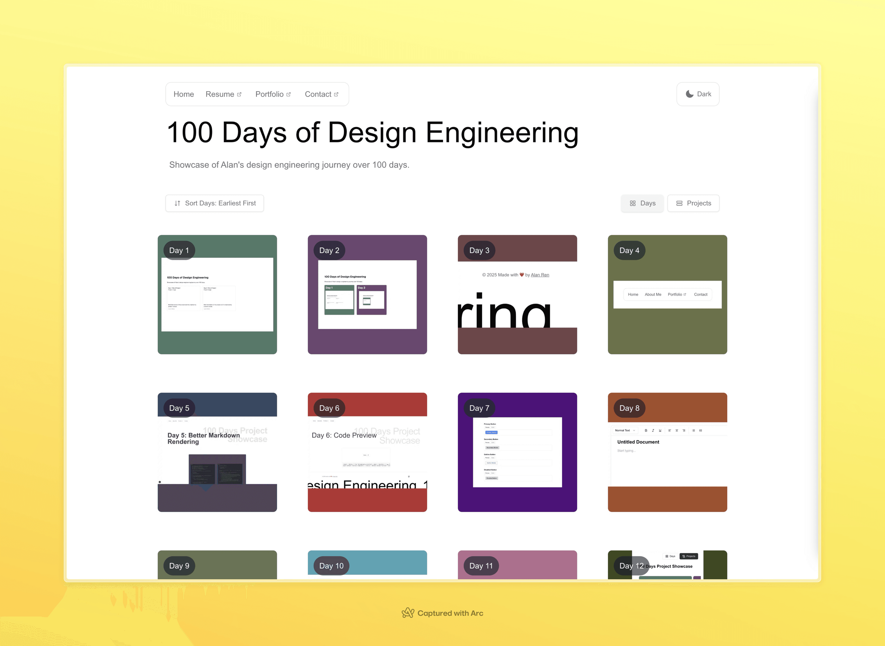
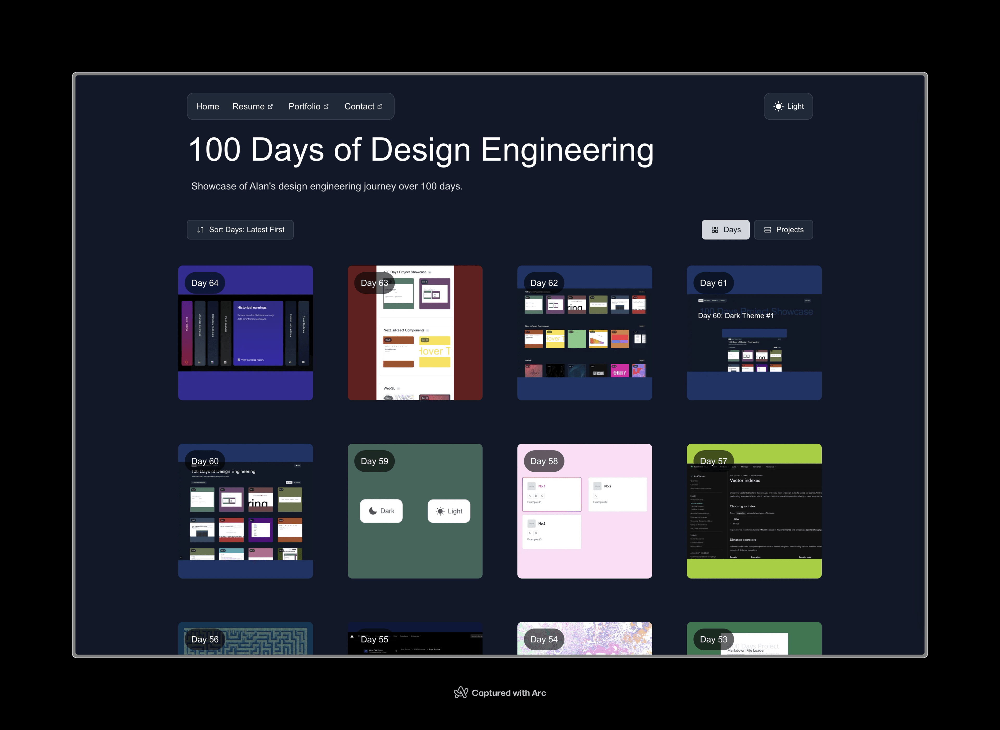
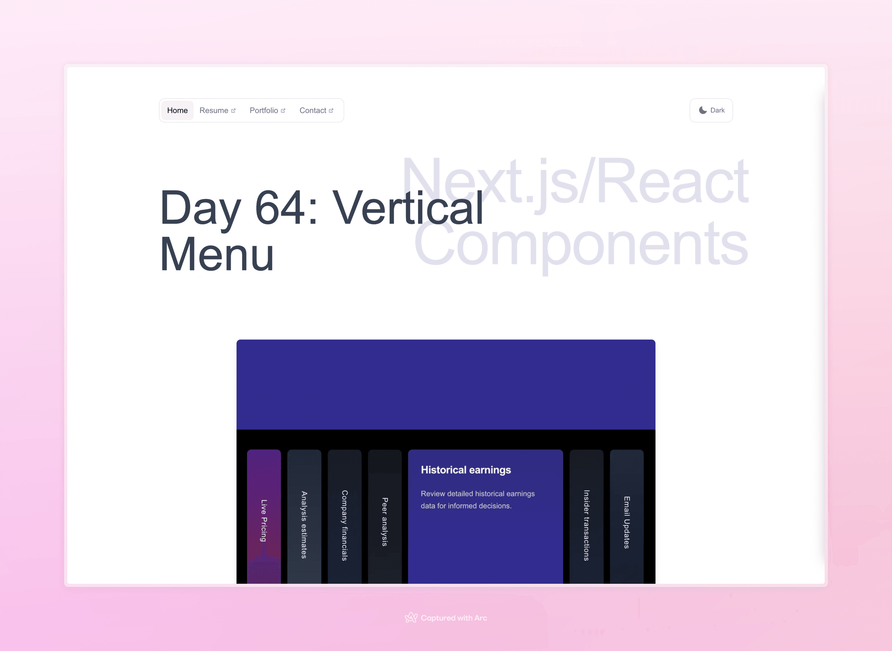
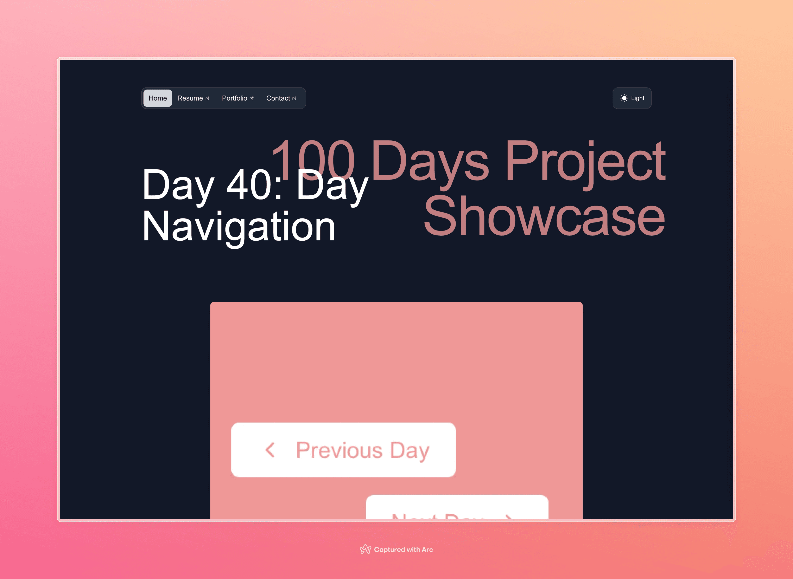

Welcome to my journey through the "100 Days of Making" class at NYU ITP, where I focused on design engineering with an emphasis on interactive web development. This project documents daily experiments and UI studies built with Next.js, React components, and WebGL shaders.

## Selected Experiments

<ImageGrid cols={2} caption="Selected daily builds from 100 Days of Design Engineering">
  
  
  
  
</ImageGrid>

The "100 Days of Making" practice established a disciplined loop of rapid prototyping, shader experimentation, and interaction polish across TypeScript, Next.js, React, and WebGL.
