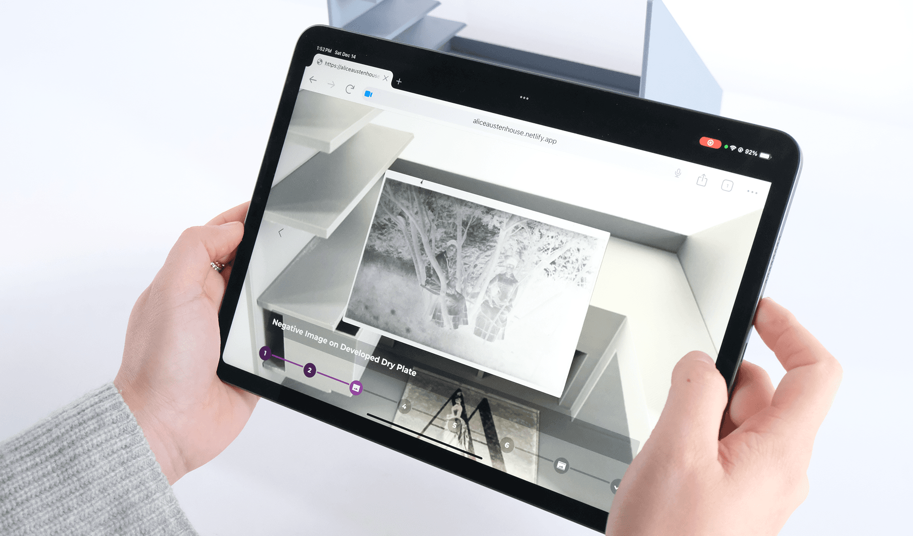
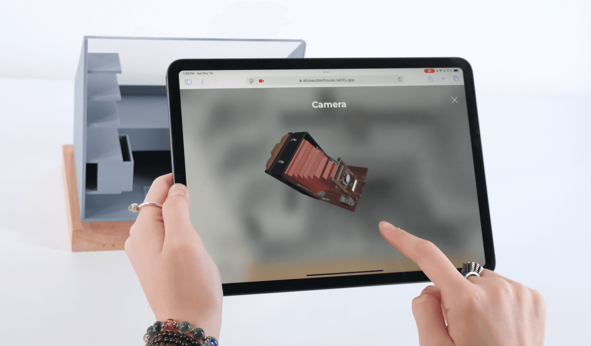
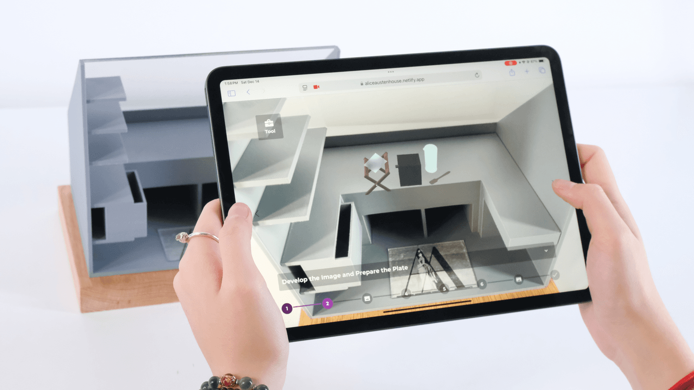
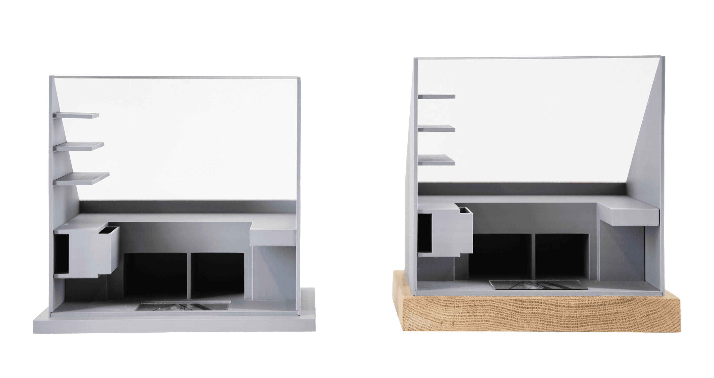

We redesigned the exhibition experience for the historic second-floor darkroom at the Alice Austen House Museum, making an architectural space that is physically inaccessible to many visitors engaging and tangible through WebAR, digital fabrication, and tactile media.

Our final deliverables to the museum included two 1:12 scale physical models of the darkroom, a browser-based augmented reality experience demonstrating nineteenth-century photographic plate development, and a series of tactile architectural reliefs of the darkroom's façade installed along the first-floor staircase.

## Exhibition Deliverables & Scale Prototypes

<ImageGrid cols={2} caption="1:12 scale darkroom models, tactile staircase reliefs, and WebAR experience">
  
  
  
  
</ImageGrid>
