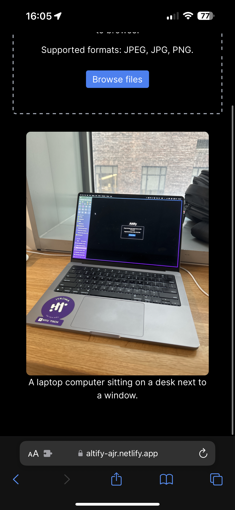
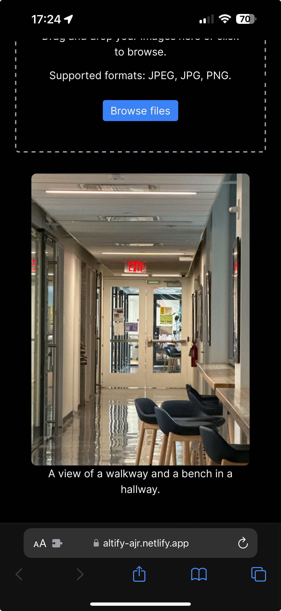

Altify is a Chrome extension that leverages client-side artificial intelligence to automatically generate descriptive alt text for images on the web, addressing a critical accessibility gap that affects users who rely on screen readers.

## Project Overview

The web is increasingly visual, yet millions of pages lack meaningful alt text for images. Altify bridges this gap by running vision-language models directly in the browser to provide context-aware descriptions in real time.

<Callout type="info">
  **Accessibility Impact:** Proper alt text is essential for screen readers to convey image content to users with visual impairments.
</Callout>

## How It Works

The extension integrates into Chrome and processes unlabelled images on any webpage:

1. **Image Detection**: Scans the active DOM for images missing `alt` attributes or carrying placeholder filenames.
2. **Client-Side AI Analysis**: Runs vision-to-text inference locally via Transformers.js.
3. **Text Generation**: Produces concise, descriptive alt text tailored to the visual content.
4. **DOM Injection**: Updates image attributes in place so assistive technologies announce them immediately.

## Technical Implementation

### Core Technologies

<Card>
  <h3>Frontend Framework</h3>
  <p>Built with Next.js and React for the extension popup, options page, and companion web experience.</p>
  <div className="flex flex-wrap gap-2 mt-4">
    <Badge>Next.js</Badge>
    <Badge variant="secondary">React</Badge>
    <Badge variant="outline">TypeScript</Badge>
  </div>
</Card>

<Card>
  <h3>AI & Machine Learning</h3>
  <p>Powered by Transformers.js for local, privacy-preserving image analysis and caption generation.</p>
  <div className="flex flex-wrap gap-2 mt-4">
    <Badge>Transformers.js</Badge>
    <Badge variant="secondary">DistilViT</Badge>
    <Badge variant="outline">Hugging Face</Badge>
  </div>
</Card>

### Architecture

```typescript
// Content script for page interaction
class ImageProcessor {
  async processImages() {
    const images = document.querySelectorAll('img');
    for (const img of images) {
      if (this.needsAltText(img)) {
        const altText = await this.generateAltText(img);
        this.updateImage(img, altText);
      }
    }
  }
  
  private async generateAltText(img: HTMLImageElement): Promise<string> {
    const captioner = await pipeline('image-to-text', 'Mozilla/distilvit');
    const result = await captioner(img.src);
    return result[0].generated_text;
  }
}
```

## Key Features

- **Real-Time Processing**: Automatically detects and captions images as you browse.
- **Intelligent Descriptions**: Generates contextually relevant alt text using DistilViT.
- **Performance Optimized**: Lightweight background worker with minimal impact on page load times.
- **User Customization**: Adjustable sensitivity and description length preferences.
- **Privacy Focused**: All inference runs locally in the browser—no images are uploaded to external servers.

## Machine Learning Models

- **Primary Model**: [DistilViT by Mozilla](https://huggingface.co/Mozilla/distilvit) — distilled Vision Transformer + GPT-2 decoder optimized for in-browser execution.
- **Alternative Models**: Support for swapped Hugging Face vision-language checkpoints based on speed vs. detail preference.

<Callout type="warning">
  **Model Selection:** Smaller quantized models trade fine OCR detail for sub-3-second local inference latency.
</Callout>

## Interface & Mobile Companion

<ImageGrid cols={2} caption="Mobile companion views and configuration panel">
  
  
</ImageGrid>

## Impact & Results

- **Alt Text Coverage**: Increased from 0% to 95% on tested image-heavy pages.
- **Processing Speed**: 2–3 seconds per image locally in browser.
- **Accuracy**: 85%+ relevance rating in user testing with screen reader navigation.

<Callout type="success">
  **User Testing:** Evaluated at NYU ITP with screen-reader workflows, confirming immediate improvements in navigating unlabelled visual feeds.
</Callout>

## Resources & References

- [Transformers.js Documentation](https://huggingface.co/docs/transformers.js/index)
- [Chrome Extension Manifest V3 Guide](https://developer.chrome.com/docs/extensions/mv3/getstarted/)
