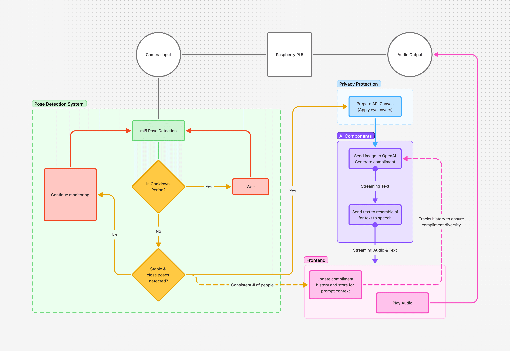

*Compliment Machine* is an AI-driven interactive installation created in collaboration with Ziggy Yang that uses the artist's digitally cloned voice to compliment passersby. Rooted in an upbringing in Xi'an, China shaped by discipline and emotional restraint, the work examines how familial and cultural environments condition personal expression. By speaking through a synthesized proxy of his own voice, the artist articulates warmth he was never taught to voice directly—turning the machine into a vessel for long-silenced emotion.

## System Architecture

When a visitor steps in front of the installation, an embedded camera detects their presence and triggers a microcontroller pipeline. The system requests a short, contextually tailored compliment from an LLM (OpenAI API), synthesizes the line in real time through a custom voice-cloning model trained on the artist's voice (Resemble AI), and projects the audio through a horn megaphone.

As the creative technologist for the installation, I engineered the end-to-end hardware and software pipeline:

- **Presence & Vision Trigger**: Configured the camera detection loop and microcontroller state machine to debounce crowd movement and trigger generation reliably in gallery conditions.
- **Low-Latency LLM + TTS Pipeline**: Connected the prompt generation API to Resemble AI's voice synthesis stream to minimize pause time between detection and spoken output.
- **Embedded Megaphone Playback**: Integrated compact embedded audio routing and enclosure electronics for continuous autonomous exhibition operation.

