*Different Paths, The Same End.* is a collaborative installation and web exhibition that examines the human impact of China's zero-COVID policy. During the policy's enforcement, municipal health authorities published the granular travel histories of positive cases in local news outlets—exposing private daily routines to public scrutiny before ending in mandatory centralized quarantine.

To materialize this tension between surveillance and ordinary life, we researched published epidemiological logs and constructed annotated maps for eight cities. Each map is mounted beneath a physical magnifying glass, inviting viewers to peer into strangers' movements the way internet bystanders scrutinized published case logs. Alongside the maps, we authored bilingual narratives (Chinese and English) reconstructing the ordinary days that preceded the shared final sentence: *"I am going to be quarantined."*

## Physical Installation & Printed Books

<ImageGrid cols={2} caption="City map installations under magnifying lenses and printed bilingual editions">
  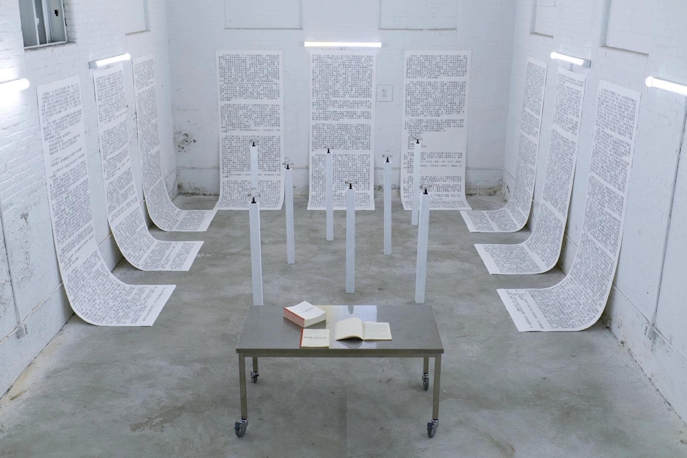
  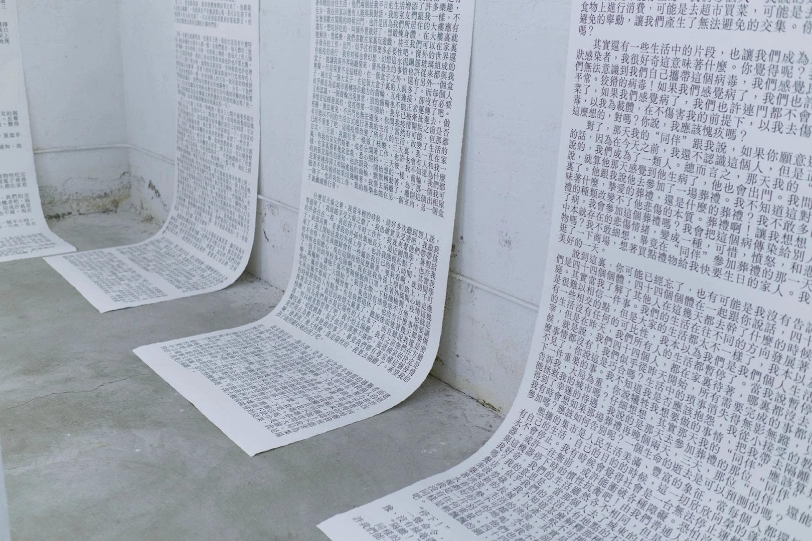
  
  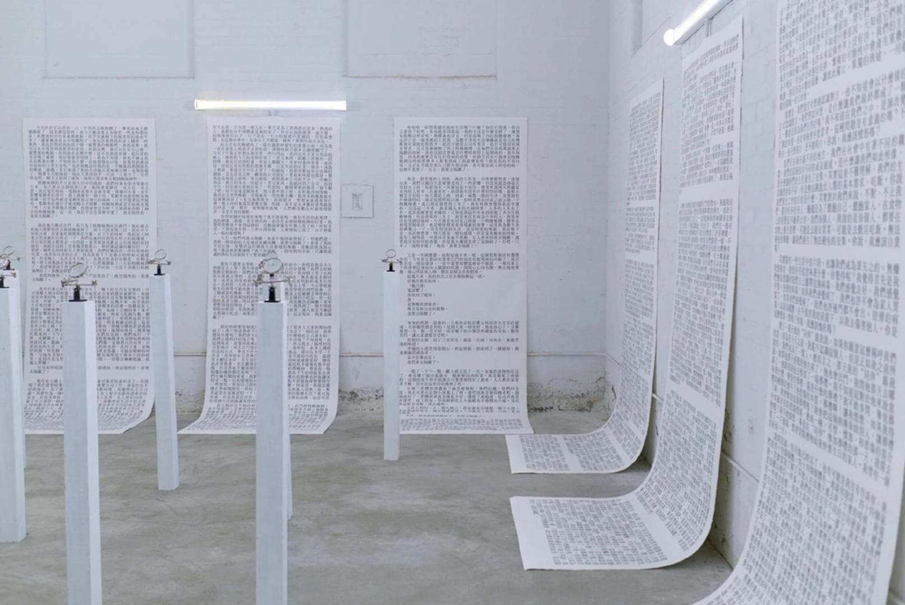
  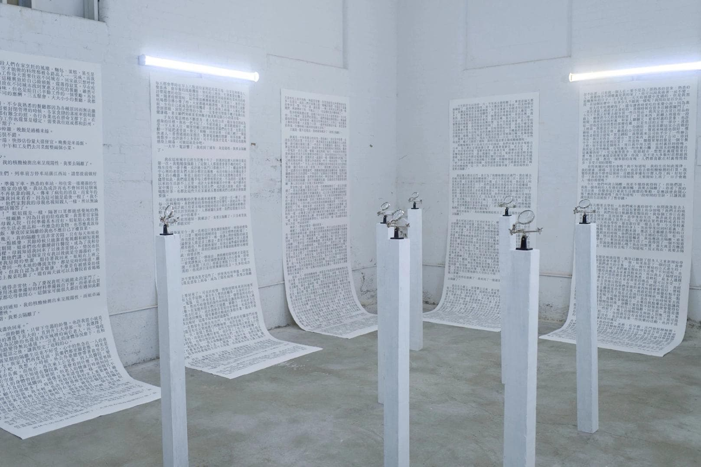
  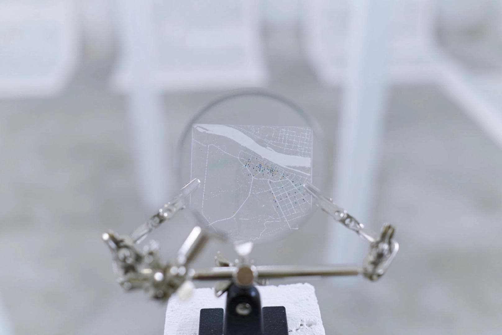
  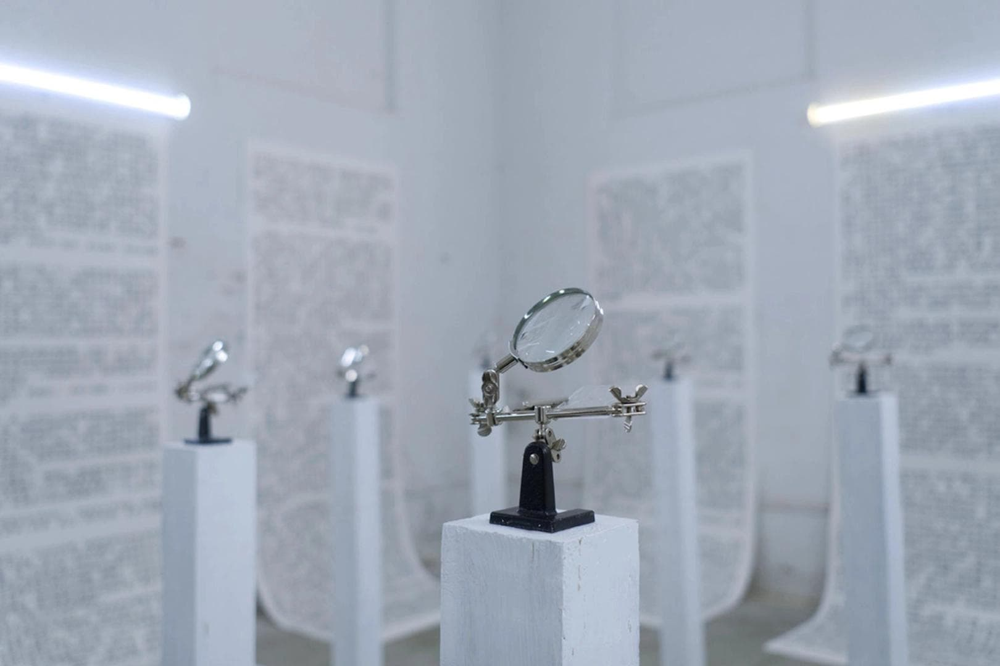
  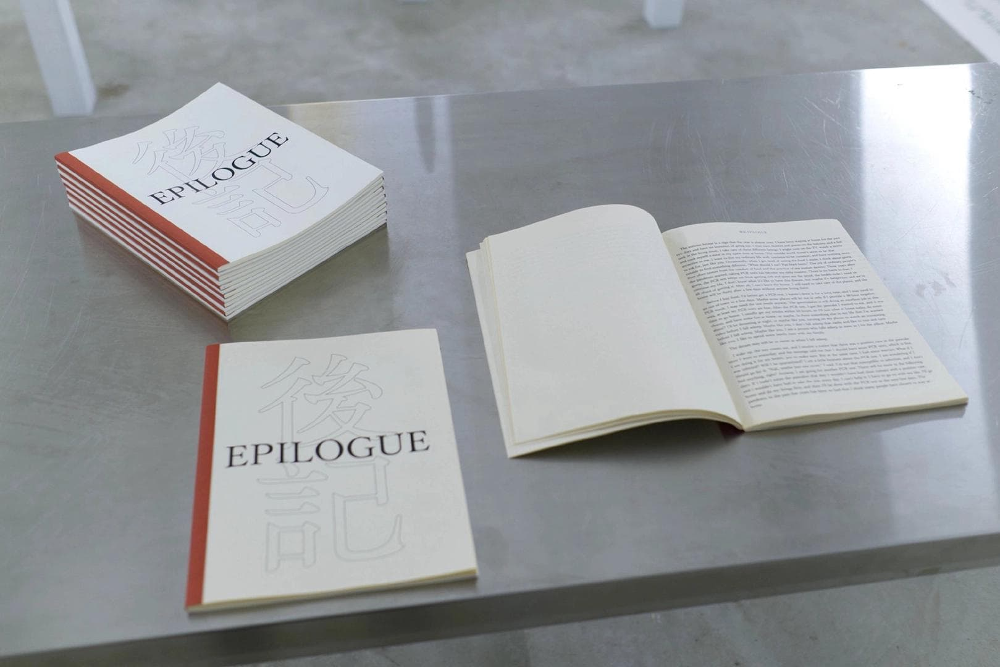
</ImageGrid>

## Online Exhibition

The companion web archive translates the physical installation into the browser, featuring an interactive magnifying-glass inspection canvas, traditional horizontal Chinese editorial typography, and synchronized bilingual reading views.

<ImageGrid cols={2} caption="Interactive web archive with magnifying glass simulation and bilingual layout">
  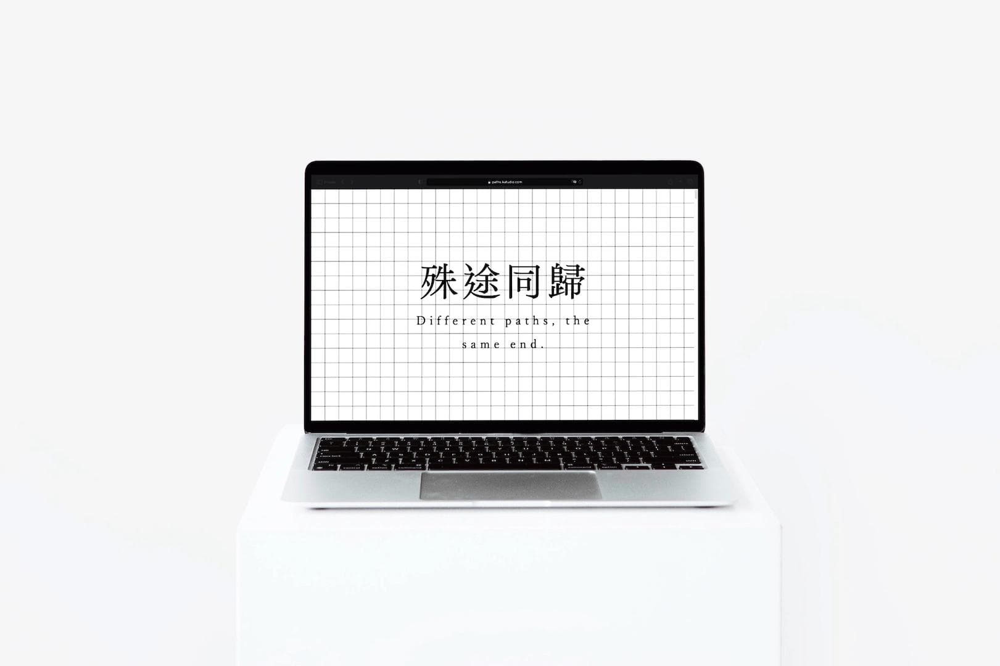
  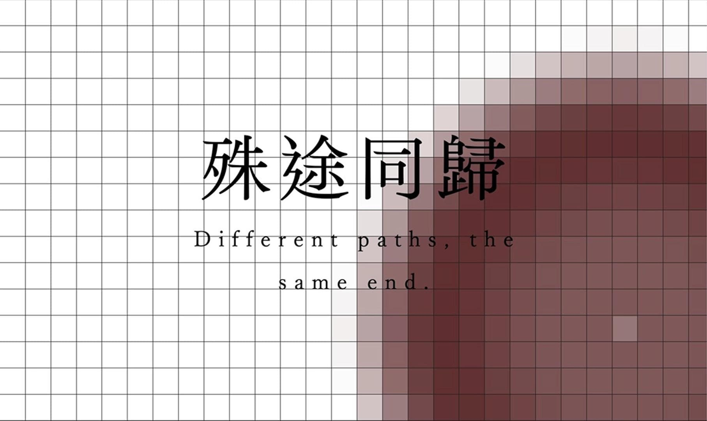
  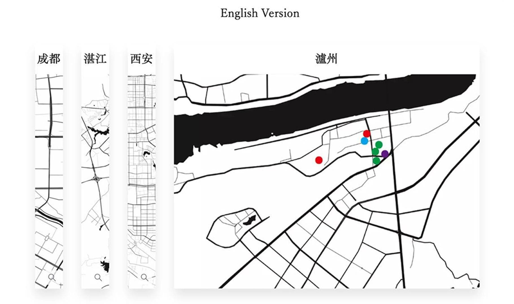
  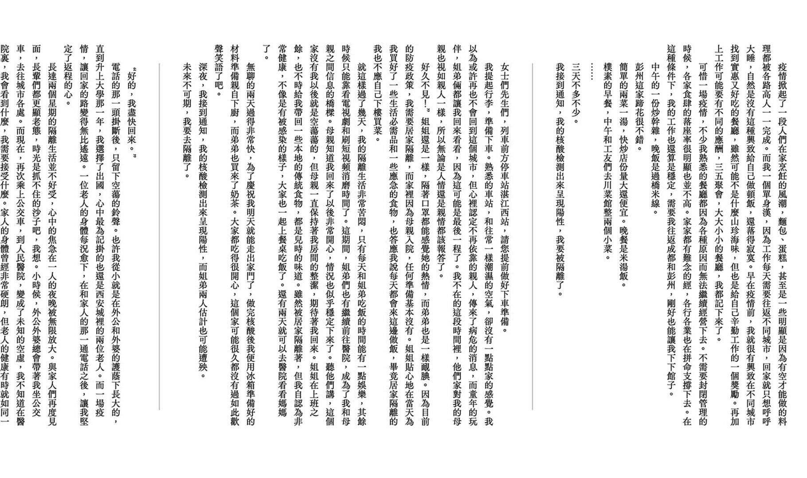
</ImageGrid>
