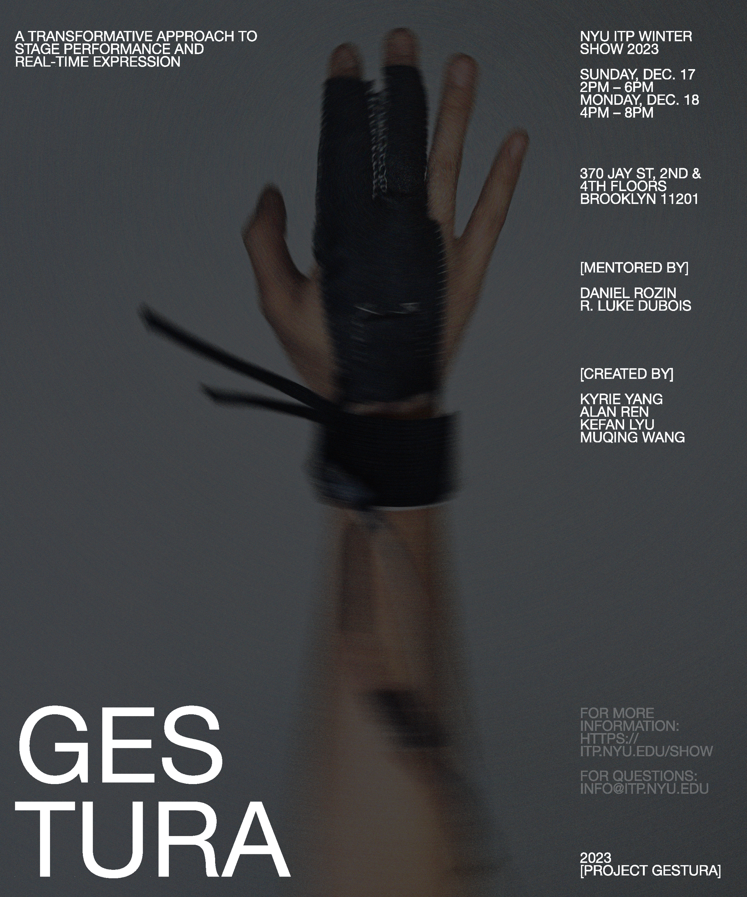

Gestura is a wearable performance instrument designed in collaboration with artists with cerebral palsy and limited speech abilities. By translating subtle finger and arm movements into real-time audio and visual modulation, Gestura expands stage expression beyond vocal communication.

Each gesture acts as a brushstroke on a live stage canvas, mapping physical motion directly to synthesized soundscapes and reactive projection visuals. Built around customizable calibration profiles, Gestura adapts to each performer's individual range of motion rather than requiring the performer to conform to a fixed interface.
