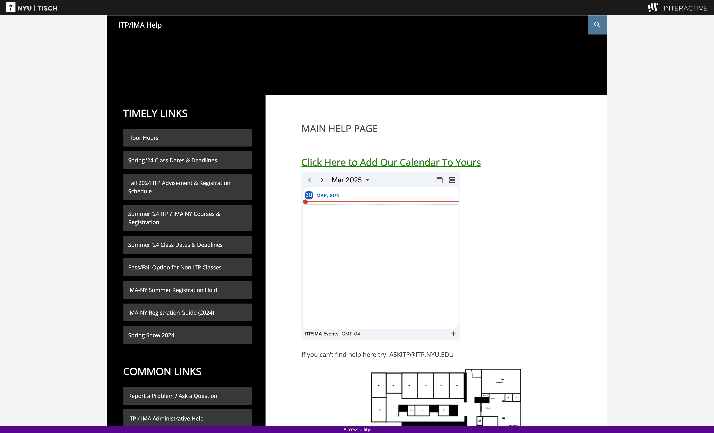
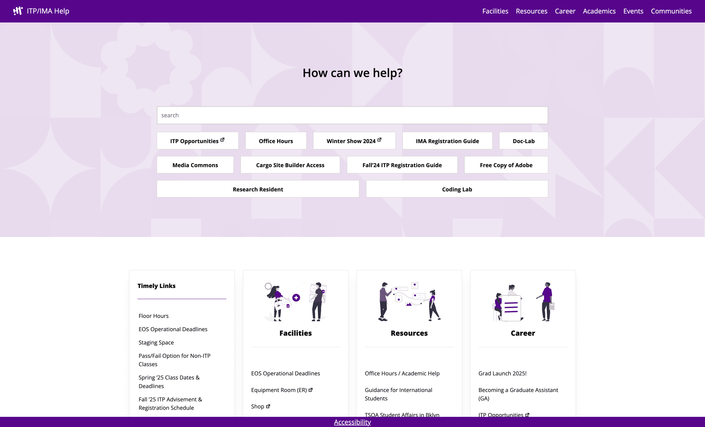
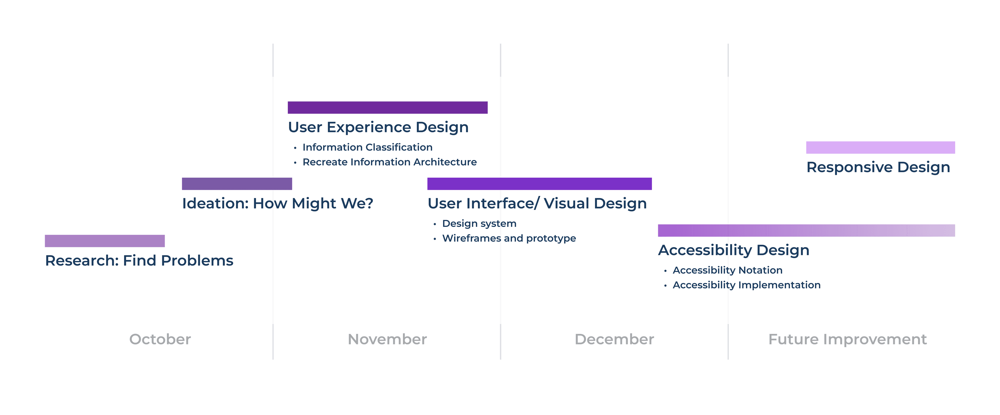
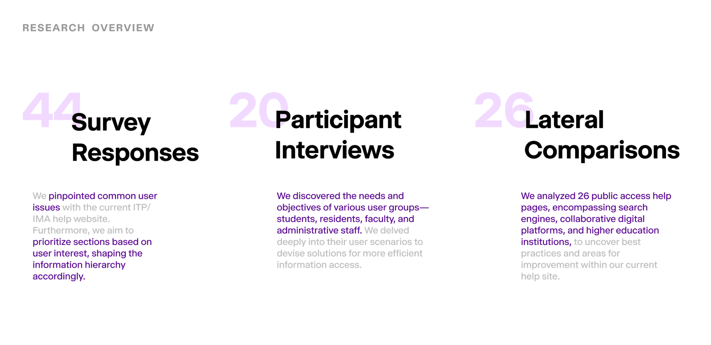
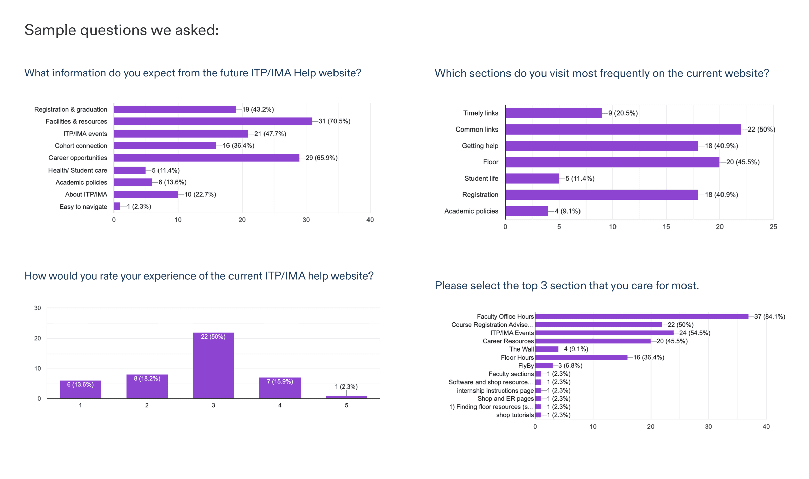
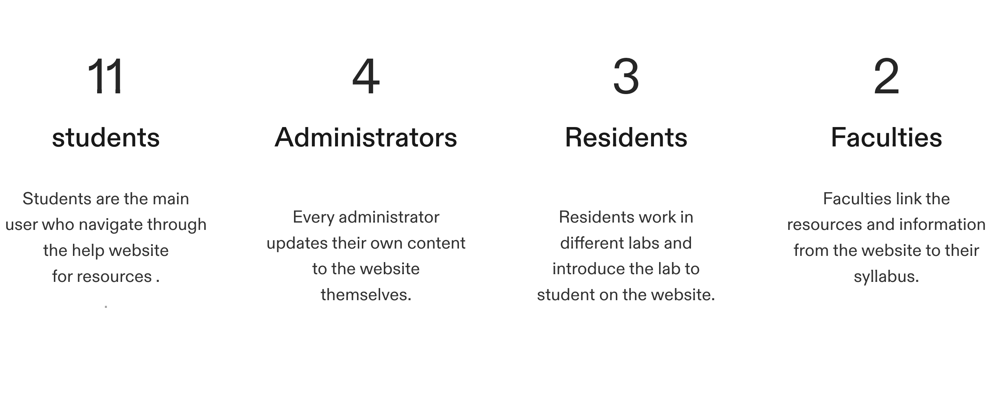
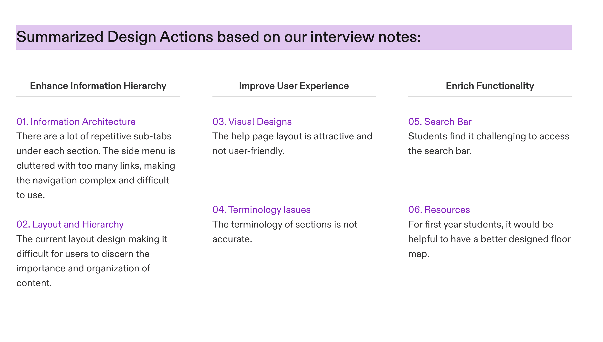

In October 2023, our team initiated a volunteer redesign of the NYU ITP/IMA Help website, which serves program resources, equipment guides, and floor information to all students, faculty, and staff at NYU's Tisch School of the Arts. After pitching our redesign proposal in December 2023, the department adopted the initiative as an official on-campus project. Following stakeholder alignment and iterative testing across Spring and Summer 2024, the redesigned platform launched in Fall 2024.

Supervised by Scott Broussard, Lenin Compres, and the NYU Digital Accessibility team, the project focused on two primary goals: achieving strict digital accessibility compliance and rebuilding the information architecture so students can locate technical resources immediately.

## Information Architecture & Visual Redesign

We reconstructed the site's taxonomy, overhauled the search experience, and introduced a high-contrast, scannable layout tailored to workshop and lab reference guides.

<ImageGrid cols={2} caption="Redesigned navigation, landing layout, and documentation views">
  
  
  
  
</ImageGrid>

## User Research & Quantitative Findings

We conducted 15+ stakeholder interviews and surveyed 40+ students and faculty regarding device habits, navigation friction, and most-visited resource categories:

- **75.0%** of users navigate the site primarily through the Search function.
- **63.7%** reported that the legacy visual hierarchy made scanning documentation difficult.
- **52.3%** struggled to locate specific lab or equipment policies under the old category tree.
- **86.4%** access the platform primarily from laptops during studio or lab sessions.

## Stakeholder Interviews & Testing

In-depth interviews with students, shop staff, and faculty directly shaped the search ranking weights and top-level category structure.

<ImageGrid cols={2} caption="Qualitative synthesis and information architecture restructuring">
  
  
</ImageGrid>
