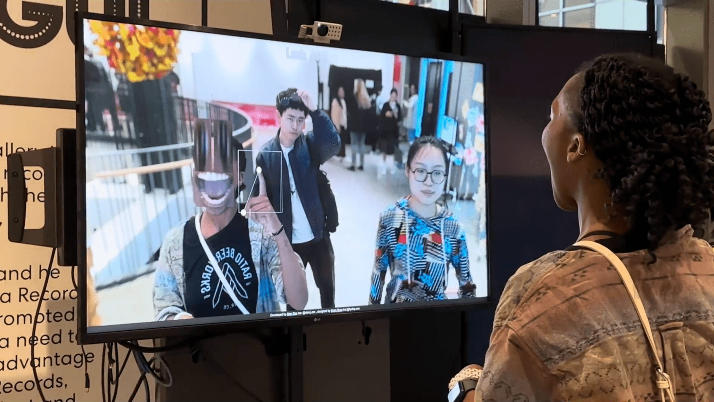

*Look At You!!!* is an interactive mirror installation created in collaboration with [Kyrie Yang](https://www.instagram.com/kyriey.ooo/) to bring playfulness and self-appreciation into everyday routines. Inspired by the daily ritual of checking a mirror before heading to work or class, the piece uses real-time computer vision to invite passersby to pause, gesture, and smile.

## Interaction & Technical Setup

Running two concurrent machine learning models in the browser via ml5.js—**HandPose** (tracking up to 20 hands) and **FaceMesh** (tracking up to 10 faces)—the installation maps facial landmarks and hand gestures onto a life-sized 70-inch portrait display driven by a 4K webcam and Mac mini. Visitors can stretch, warp, and animate their reflections in real time through physical movement.

## Documentation — ITP/IMA Spring Show 2024

