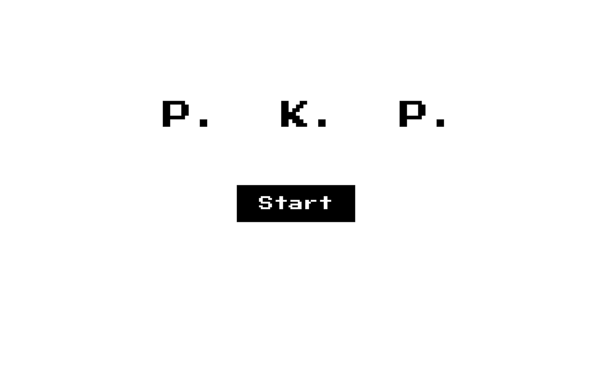
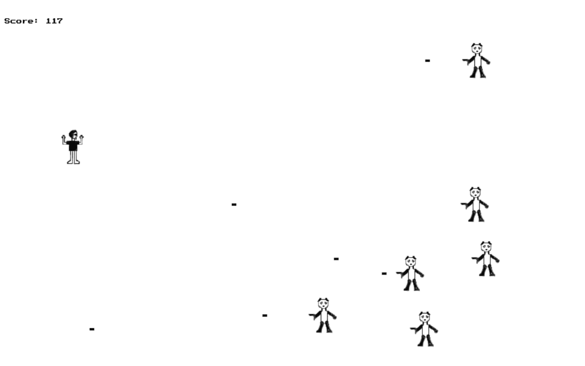
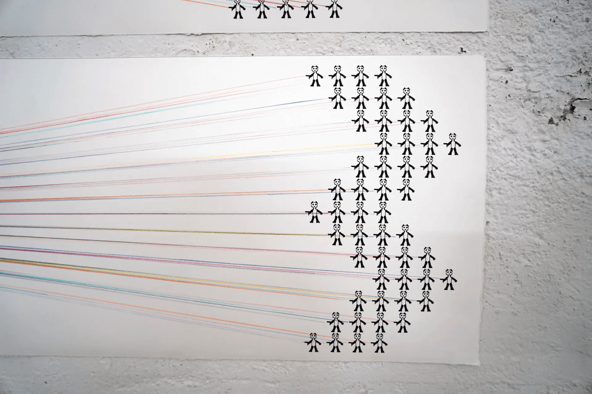

Created in collaboration with Jixin Zheng, *Project P.K.P* examines the viral social media frenzy surrounding a giant panda in the United States—exploring how an apolitical symbol can be weaponized into polarized online nationalist discourse. Combining hand-drawn illustration, editorial print publication, and an interactive browser game, the work traces how algorithmic amplification turns spectacle into hostility.

## Print Publication & Online Experience

<ImageGrid cols={2} caption="Editorial spreads, illustration studies, and browser game scenes">
  
  
  
  
</ImageGrid>

