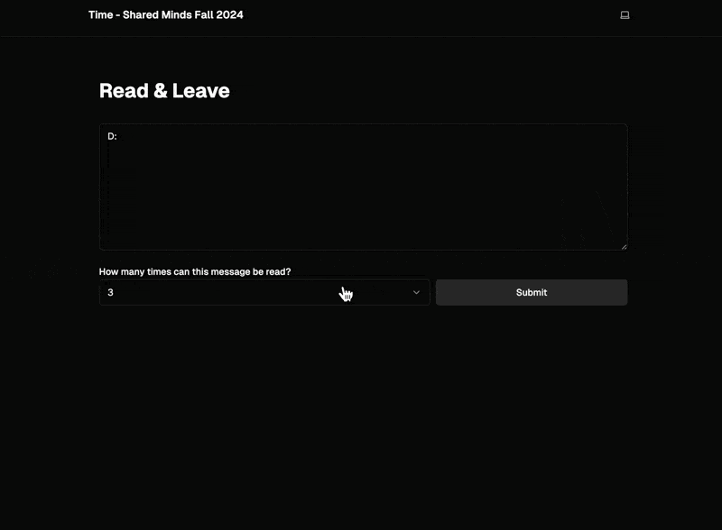
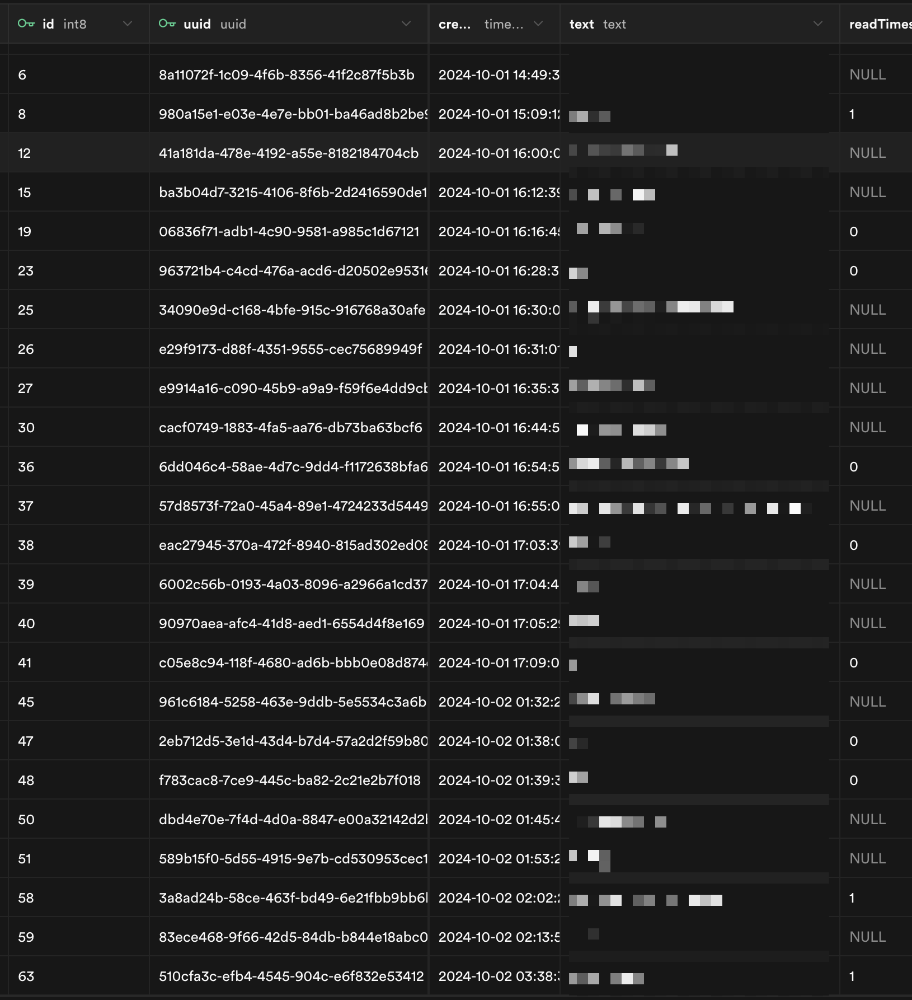

Created for the *Shared Minds* course at NYU ITP (Fall 2024), **Read & Leave** explores digital ephemerality and asynchronous stranger-to-stranger communication. Visitors can leave an anonymous message in a shared pool and define its exact lifespan—not by wall-clock time, but by **how many times the message is allowed to be read**.

## Ephemeral Scarcity Mechanics

Most web platforms treat user-generated text as permanent rows indexed forever. *Read & Leave* inverts that default by turning attention into a finite resource:

1. **Compose & Constrain**: When submitting a message, the author selects a read limit (`1`, `3`, `5`, or `Unlimited`).
2. **Consume & Decrement**: Each time a visitor pulls a random message from the pool, its remaining `readTimes` counter decrements atomically.
3. **Vanish on Exhaustion**: Once `readTimes` reaches `0`, the message ceases to surface, making every finite read an irreversible exchange between writer and reader.

## Backend State & Persistence

Messages are stored in a **Supabase PostgreSQL** table keyed by `id` and `uuid`, tracking `created_at`, message `text`, and a nullable `readTimes` integer (`NULL` for unlimited reads, or a countdown integer for ephemeral notes).

<Callout type="note" title="Author Review Note">
  Add live deployment URL or GitHub repository link in frontmatter (`projectUrl` / `githubUrl`) and any observations from class playtesting in *Shared Minds*.
</Callout>
