*The Theater* is an interactive VR theatre piece that blends traditional Chinese opera aesthetics with contemporary mechanical design, combining live choreography, optical and AI motion capture, and controller-free hand tracking to explore the tension between individualism and collectivism.

The experience presents two contrasting virtual worlds—one embodying Eastern collectivism and the other Western individualism. Each world unfolds as a living stage where audiences actively shape the performance through physical gesture and movement, reflecting on how cultural frameworks mediate personal identity and communal belonging.

## Shan Gui — 3D Short Film & Visual World

The accompanying 3D short film, *Shan Gui*, serves as the visual and thematic prologue for the VR experience. Reimagining the Mountain Spirit from Qu Yuan's classical poem as an androgynous mechanical figure in Unreal Engine 5, the film establishes the project's core themes of isolation, longing, and cultural memory.

<ImageGrid cols={2} caption="Stills from Shan Gui, rendered in Unreal Engine 5">
  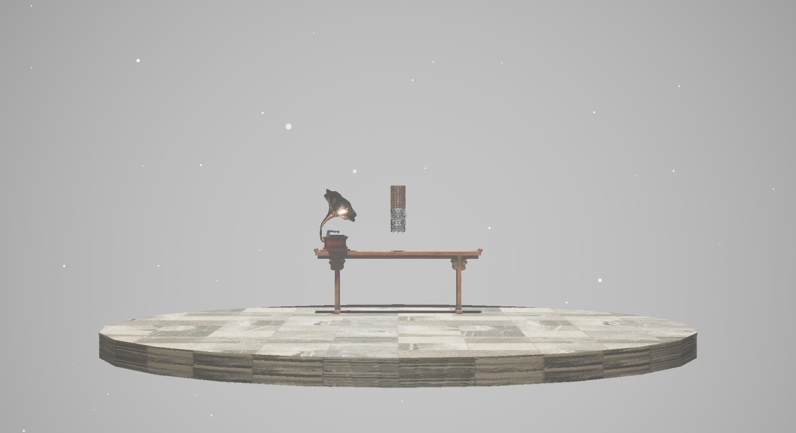
  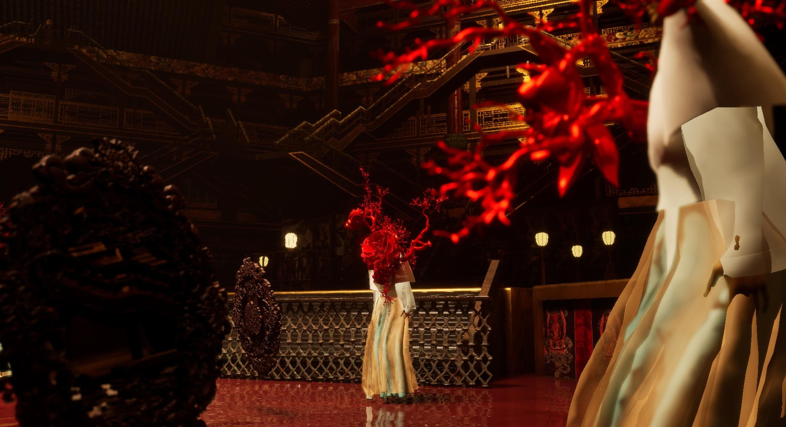
  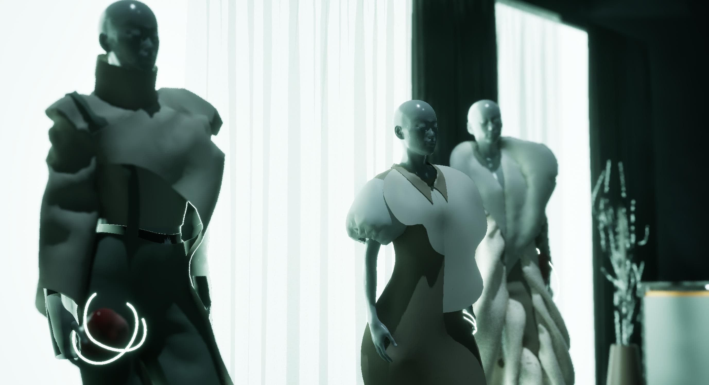
  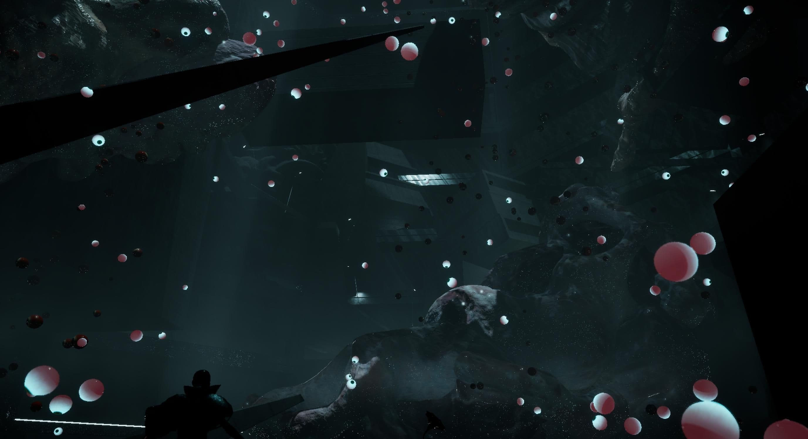
  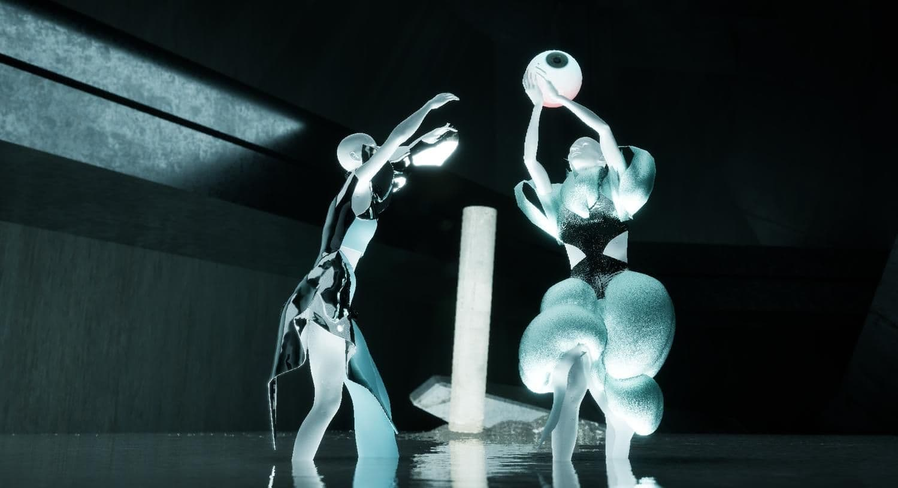
  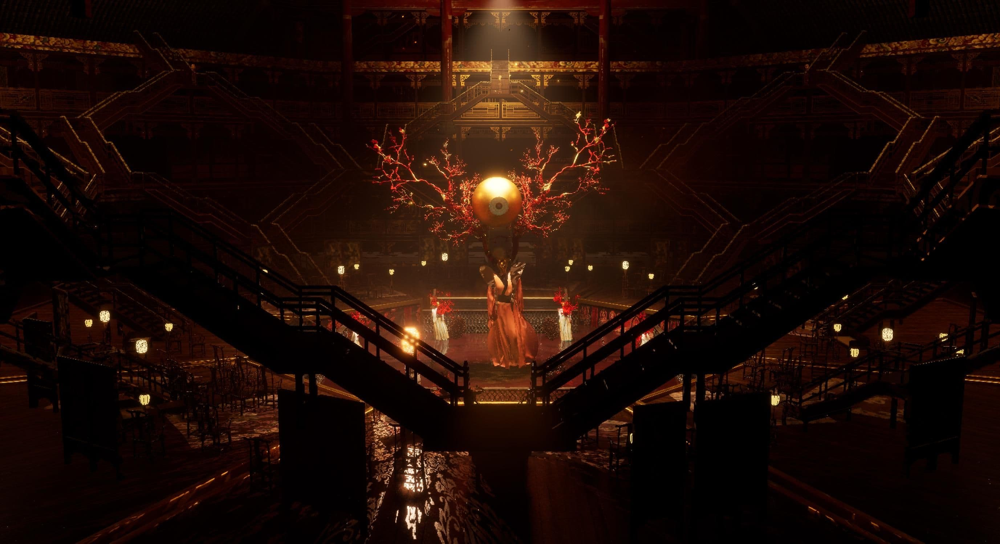
  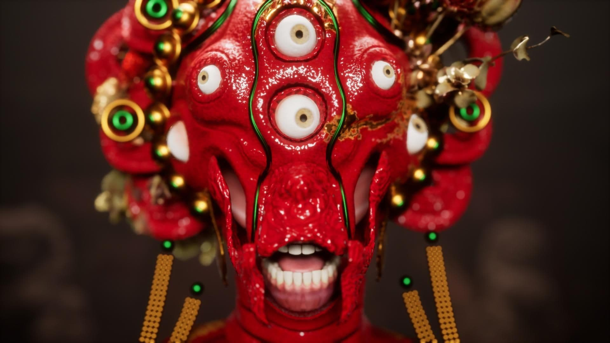
  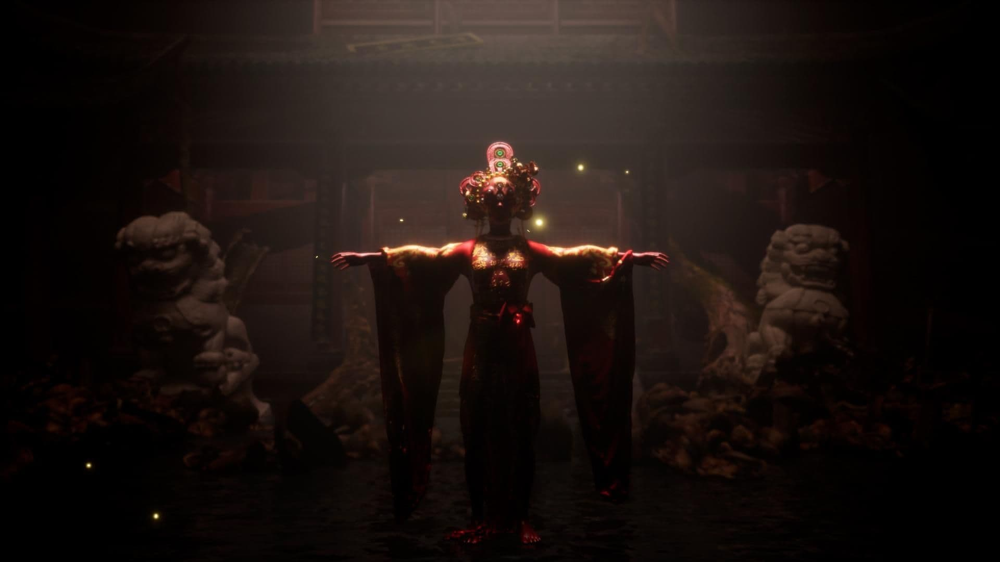
</ImageGrid>

## Motion Capture & Interactive Choreography

Performances combine AI motion capture (Qian Mian) with multi-camera OptiTrack volumes to record professional dancers. AI mocap enables performers to rehearse in unconstrained spaces, while OptiTrack captures high-precision multi-performer interactions for real-time VR staging.

<ImageGrid cols={3} caption="Motion capture sessions and real-time skeletal retargeting">
  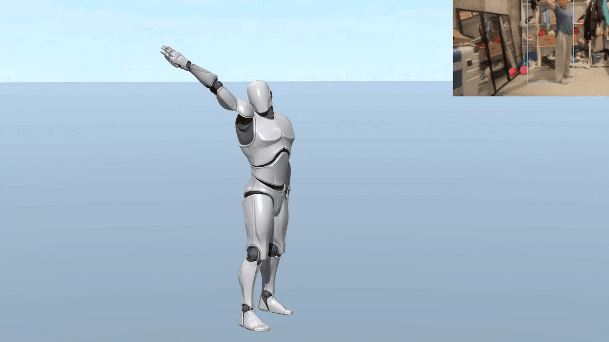
  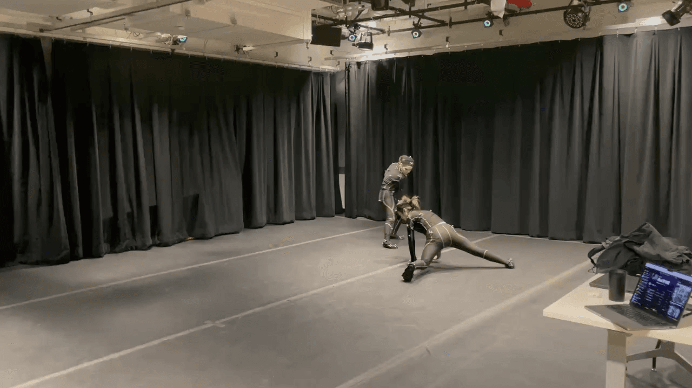
  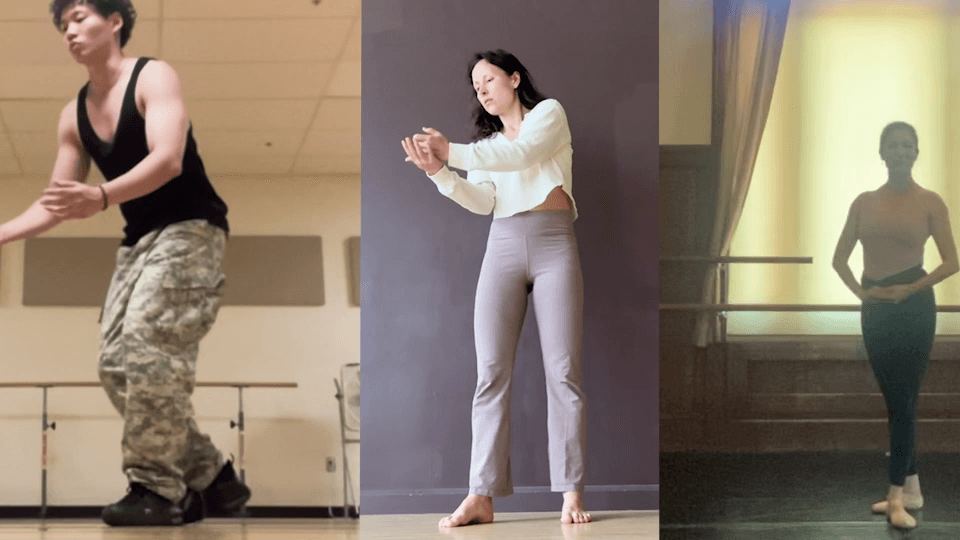
</ImageGrid>

## Digital Fashion & Cloth Simulation

Costumes were designed in Marvelous Designer and simulated in real time using Unreal Engine 5's Chaos Cloth solver, paired with AI-assisted 3D ornamental modeling to preserve the movement and silhouette of traditional theatrical garments inside VR.

<ImageGrid cols={2} caption="Garment simulation and character ornamentation in Unreal Engine 5">
  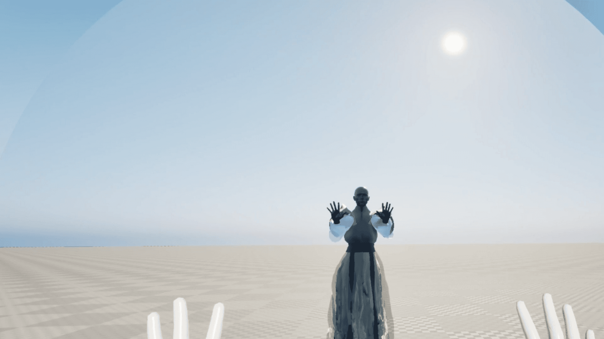
  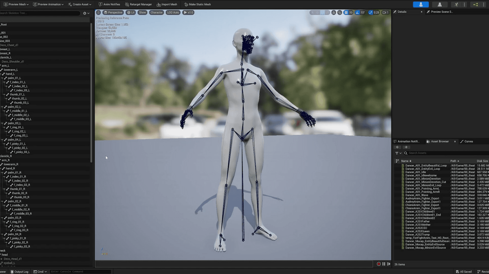
  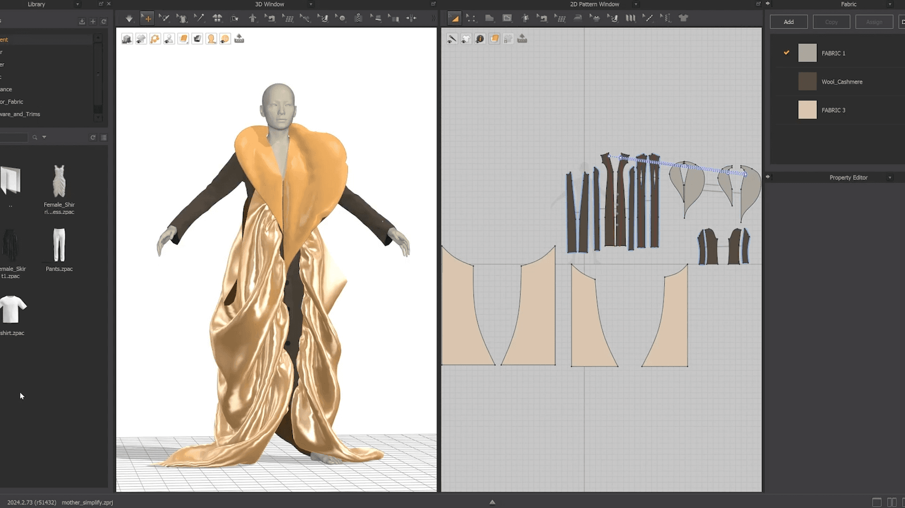
  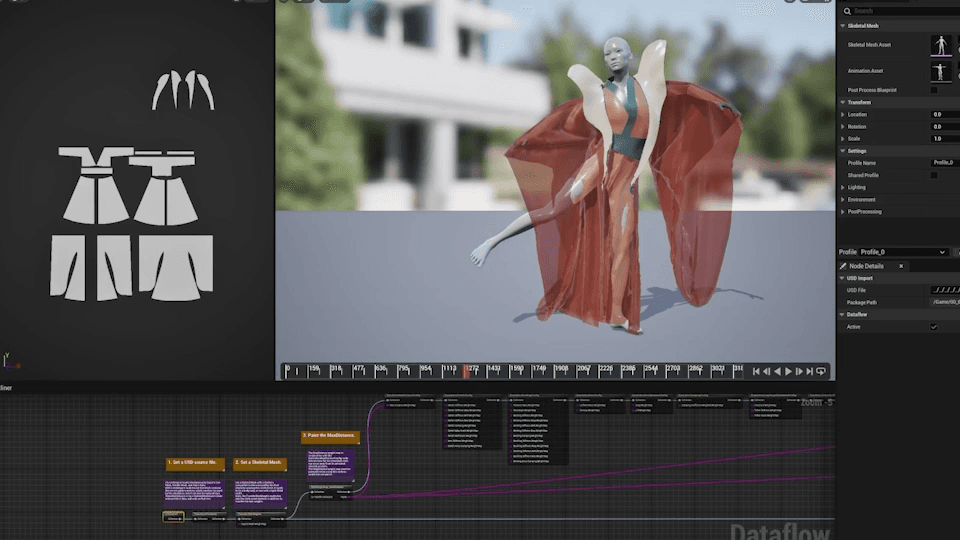
</ImageGrid>

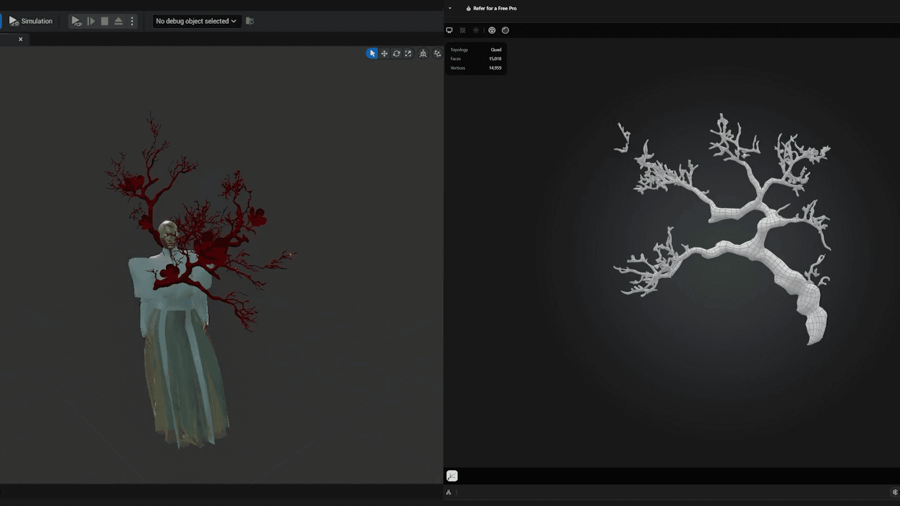

## Credits

- **Co-Directors**: John Luo, Yingru Huang
- **Choreography Director**: Yingru Huang
- **Screenplay Co-Director**: Lois He
- **Game Developers**: John Luo, Alan Yam
- **Tech & 3D Artists**: John Luo, Kano Tao, Yi Wang
- **Fashion Designers**: Maggie Zhou, Yoyo Shang
- **Fashion Consultants**: Elena Liu, Annie Xing, Laurel Fang
- **Music Composers**: Yingru Huang, Alexia Diaz, Chienn Tai
- **Hand Tracking Template**: Jason Meisel
- **Motion Capture Performers**: Yingru Huang, Tanya Xu, Wisdom Zhang, Audrey Chou, Chienn Tai, Siyu Duan, Karin K. Jensen, Kylie Boyd, Kamala Fifield, Addy Bradley, Kai Hannigan
