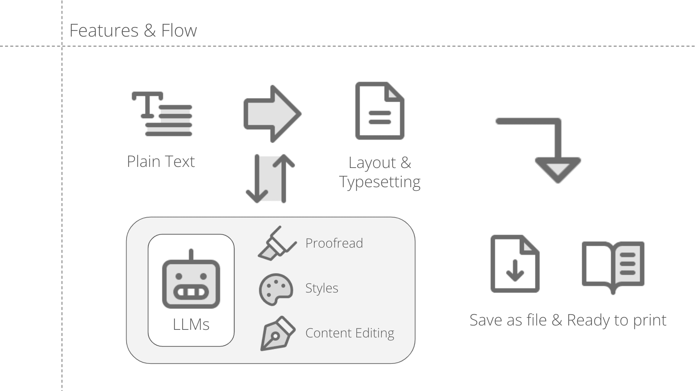
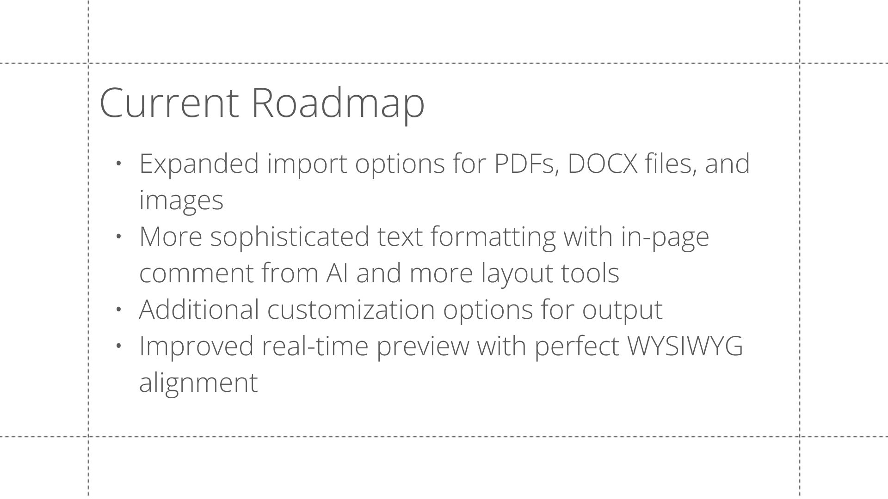

Typer addresses a persistent bottleneck in editorial and publication design workflows. Legacy desktop publishing tools impose steep learning curves and manual, repetitive formatting overhead. Our user research across design practitioners showed that even single-sheet poster layouts require 5–6 hours of iteration, while multi-chapter book layouts span weeks of manual style synchronization.

Targeting early-career creatives transitioning from academic studio work to commercial practice, Typer uses large language models to automate structural typesetting, hierarchy normalization, and preflight proofreading—freeing designers to focus on typographic direction and visual composition.

## Research Insights

Through in-depth interviews with graphic and editorial designers, three structural findings shaped the product architecture:

- **Time Investment Reality**: Layout duration scales non-linearly with page count and mixed media (tables, captions, bilingual footnotes), with revision cycles consuming more time than initial composition.
- **Tool Fragmentation**: While senior designers rely on rigid InDesign scripts, junior designers frequently chain multiple tools together to bridge technical gaps, introducing formatting drift between drafts.
- **Licensing Friction**: Independent designers strongly favor predictable perpetual or per-project access over costly enterprise subscriptions, highlighting an opportunity for lightweight browser-based tooling.

## Product Roadmap

