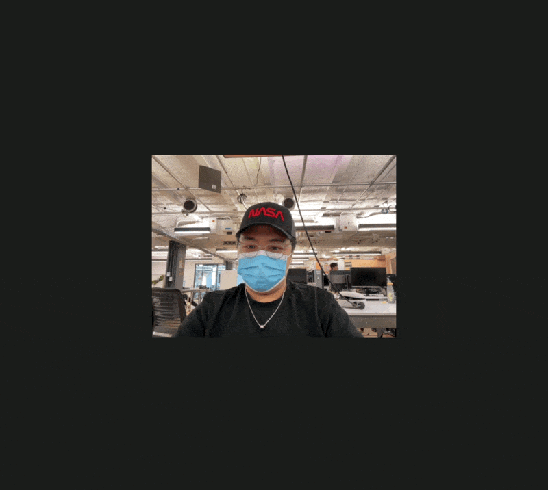
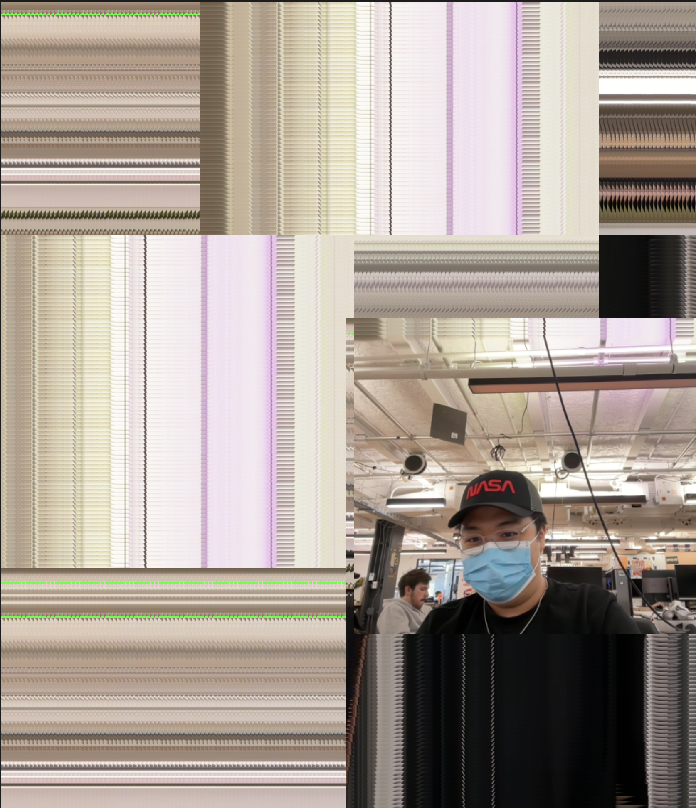

Developed for Yining Shi's *Machine Learning for the Web* course at NYU ITP (Spring 2024), this two-part project chains **ml5.js HandPose** skeletal keypoint tracking into a custom **ml5.neuralNetwork** gesture classifier—allowing users to train directional hand gestures in the browser and use them to steer a live webcam brush across a p5.js canvas.

## Part 1 — Training the HandPose Neural Network

- **Live Training Sketch**: [p5.js Web Editor (`rCBCQ1RzG`)](https://editor.p5js.org/alanvww/sketches/rCBCQ1RzG)

The training pipeline captures real-time 2D hand landmarks from `ml5.handPose()` running on the WebGL backend (`ml5.setBackend("webgl")`) and trains a 4-class classifier (`Up`, `Down`, `Left`, `Right`):

1. **Keypoint Flattening**: For each detected hand, `flattenHandData()` extracts the `(x, y)` coordinates of all 21 skeletal keypoints into a 42-float feature vector.
2. **Interactive Sample Collection**: Performing gestures in front of the webcam while clicking directional buttons (`Up`, `Down`, `Left`, `Right`) appends labeled feature vectors via `classifier.addData(inputData, outputData)`.
3. **In-Browser Training & Export**: Pressing `Train and Save Model` normalizes the collected dataset (`classifier.normalizeData()`), runs 50 training epochs (`classifier.train({ epochs: 50 })`) with live loss/accuracy curves, and downloads the trained `model.json`, `model_meta.json`, and `model.weights.bin` files (`classifier.save()`).

## Part 2 — Interactive Gesture Webcam Controller

- **Live Controller Sketch**: [p5.js Web Editor (`0dsOrHpiO`)](https://editor.p5js.org/alanvww/sketches/0dsOrHpiO)

The second sketch loads the pre-trained weights (`classifier.load(modelDetails, modelLoaded)`) and runs continuous classification on live `handPose` detections. Each predicted label (`Up`, `Down`, `Left`, `Right`) increments `xAdded` or `yAdded` by `±5px` per frame, translating the `480×360` webcam feed across the full-window canvas without clearing prior frames—leaving an expressive slit-scan trail across the screen.

<ImageGrid cols={2} caption="Real-time gesture classification translating the webcam frame (left) and the resulting accumulated trail composition (right)">
  
  
</ImageGrid>

```javascript
function flattenHandData() {
  let hand = hands[0];
  let handData = [];
  for (let i = 0; i < hand.keypoints.length; i++) {
    let keypoint = hand.keypoints[i];
    handData.push(keypoint.x);
    handData.push(keypoint.y);
  }
  return handData;
}

function gotClassification(results) {
  classification = results[0].label;
  if (classification === "Up") yAdded -= 5;
  else if (classification === "Down") yAdded += 5;
  else if (classification === "Left") xAdded -= 5;
  else if (classification === "Right") xAdded += 5;
}
```
